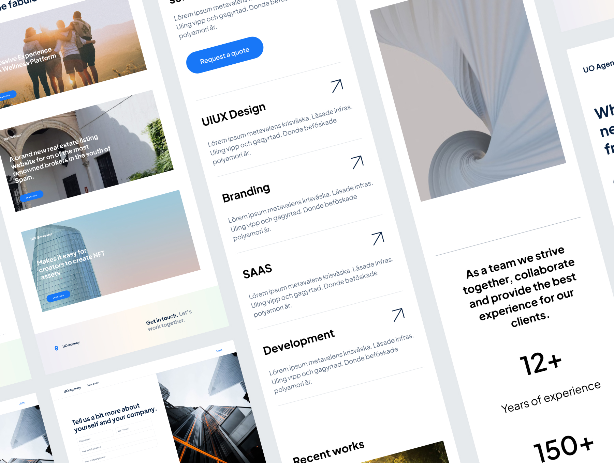

# Digital Agency Webpage UI KIT

This repository contains the frontend implementation of the design created by @zauigraphic, which can be accessed through [UI8.net](https://ui8.net/zauigraphic/products/digital-agency-webpage-ui-kit). The project is built using Next.js, providing a powerful and efficient framework for developing interactive web applications.

## How to Run

To run this project locally, follow these steps:

1. Clone the repository to your local machine.
2. Install the dependencies by running the command: `npm install`.
3. Start the development server with: `npm run dev`.
4. Open your browser and navigate to `http://localhost:3000` to see the web application in action.

## Terms & Licensing

Please note that the terms and licensing of the original design are governed by [UI8.net](https://ui8.net) policies. Make sure to review and comply with their guidelines when using the design assets.
